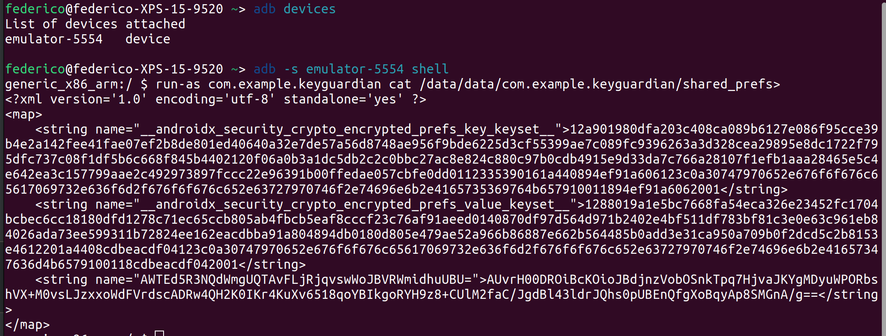

# KeyGuardian
`KeyGuardian` is an `Android` native `Kotlin` application that allows you to store secrets securely on your device using encrypted shared preferences and system authentication.  
You can protect your secrets with a pattern, PIN, or biometrics, depending on the capabilities of your device.

## Features
- Securely store secrets on your device using encrypted shared preferences
- Protect your secrets with a pattern, PIN, or biometrics
- Use system authentication to ensure maximum security

## Requirements
- Android 11.0 (API level 30) or higher
- Lockscreen security enabled (Pattern, PIN, or biometrics).  
  If you have not enabled any of these, the app will guide you to set it up otherwise you will not be able to use `KeyGuardian` 

## EncryptedSharedPreferences
[EncryptedSharedPreferences](https://developer.android.com/topic/security/data) is an `Android` library that provides a secure way to store data on the device by encrypting the data before saving it to shared preferences.  
EncryptedSharedPreferences uses the `Advanced Encryption Standard (AES)` algorithm in` Galois/Counter Mode (GCM)` with 256-bit keys to encrypt and decrypt the data.

To ensure maximum security, `EncryptedSharedPreferences` uses the [Android KeyStore system](https://developer.android.com/training/articles/keystore) to store the encryption key.  
The `Android KeyStore system` provides a secure storage area for cryptographic keys and provides a secure mechanism for accessing and using the keys.  
Keys stored in the `Android KeyStore` are protected by the device's lock screen PIN, pattern, or biometrics, depending on the device's settings.

[Jetpack Security](https://developer.android.com/jetpack/androidx/releases/security) has two types of keys, i.e. master key and subkeys.  
The subkeys are used to perform an encryption operation on the actual data and the master key is used to encrypt all subkeys.  
This has been done to add an extra security layer.

| Name          | Gets stored in                         | Does operation                    |
|---------------|----------------------------------------|-----------------------------------|
| **MasterKey** | Android Key Store                      | Encrypts and decrypts all SubKeys | 
| **SubKey**    | Shared Preferences in encrypted format | Encrypts and decrypts user data   |

Using `EncryptedSharedPreferences` is a secure way to store sensitive data on the device because the data is encrypted before it is saved to shared preferences, and the encryption key is protected by the Android KeyStore system.  
This means that even if an attacker gains access to the shared preferences file, they will not be able to read the data without the encryption key.

## Attack Scenario
Let's say that an attacker gains access to the shared preferences file and tries to read the data, with root privilege is quite simple.
In the simplest case, the attacker can use the `adb shell` command to access the device's shell and then use the `cat` command to read the shared preferences file.

But the attacker will not be able to read the data because the data is encrypted and the encryption key is protected by the `Android KeyStore system`
- `__androidx_security_crypto_encrypted_prefs_key_keyset__` alias is associated with the secret key used to secure the entire set of shared preferences of the application (`MasterKey`)
- `__androidx_security_crypto_encrypted_prefs_value_keyset__` alias is associated with the key used to secure specific values of the application's shared preferences.
- The third value is an encrypted user data.